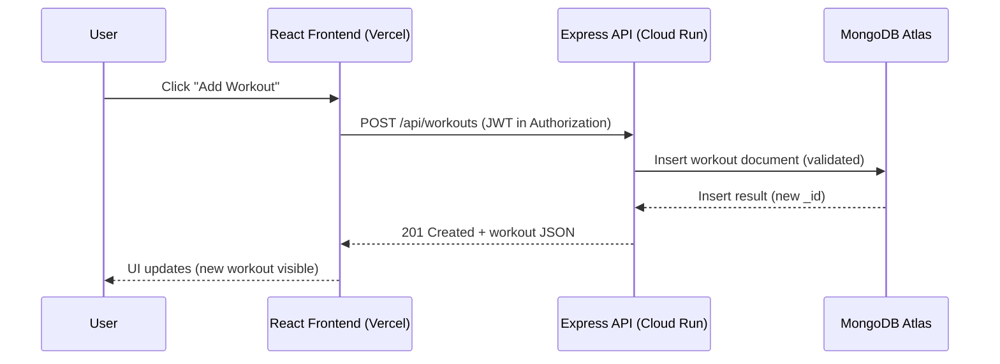

# Fitness Capstone — Full-Stack Workout Tracker

A full-stack fitness tracking app built with a **React (Vite)** frontend and an **Express + MongoDB (Atlas)** backend. Includes **Google OAuth login**, **CRUD workouts**, **external API + XState state machine**, **deployment**, and a **Playwright end-to-end test**.

---

## Live Links

- Frontend (Vercel): https://fitnesscapstonefrontend.vercel.app  
- Backend (Cloud Run): https://fitness-api-455807770760.us-east1.run.app  
- Video Demo (Google Drive): https://drive.google.com/file/d/1kBcGvtTUz5Y1O38l95DiwU7DcczJwrOy/view?usp=drive_link  
- GitHub Repo: https://github.com/ting-gao-1/fitness_capstone  

---

## Features

### React Frontend
- Deployed and publicly accessible (Vercel)
- Authentication: Google OAuth login
- Advanced React features (2+):
  - Context (global auth/user state)
  - XState (`xstate`, `@xstate/react`) for external API widget state machine
  - (Also uses controlled side-effects via `useEffect`)
- External API integration: quote/advice widget with loading + error + refresh
- Interactivity & personalization: UI changes after login and workouts are scoped per user
- Third-party React libraries: (examples) XState, SWR, React Router, Google OAuth library
- Animation: at least one meaningful UI animation (e.g., toast/transition/loading)

### Express Backend
- Cloud-deployed backend (Google Cloud Run)
- Complete CRUD for workouts: Create / Read / Update / Delete
- Database integration: MongoDB Atlas (Mongoose) with validation and error handling

### Supporting Artifacts
- Dev Container configuration
- Automated test: Playwright
- Short video demonstration
- Attribution of external sources and AI usage
- Design artifact: sequence diagram (below)

---

## Architecture Overview

- Frontend (React/Vite on Vercel) calls Backend (Express on Cloud Run) via REST.
- Backend verifies authenticated requests and performs CRUD on MongoDB Atlas.
- External API widget uses XState to manage states (idle → loading → success/failure).

---

## Project Structure

- `client/` — React frontend (Vite)
- `server/` — Express backend + routes + models

---

## Environment Variables

### Server (`server/.env`)
Create `server/.env` locally:

```env
MONGODB_URI=mongodb+srv://...
JWT_SECRET=your_long_random_secret
GOOGLE_CLIENT_ID=your_google_client_id.apps.googleusercontent.com
CORS_ORIGIN=http://localhost:5173,https://fitnesscapstonefrontend.vercel.app
DEV_LOGIN_ENABLED=true
```

### Client (`client/.env`)
Create `client/.env` locally:

```env
VITE_API_BASE_URL=http://localhost:8080
VITE_GOOGLE_CLIENT_ID=your_google_client_id.apps.googleusercontent.com
```

Notes:
- Never commit `.env` files to GitHub.
- Do not put secrets (MongoDB URI / JWT secret) into Vercel environment variables.

---

## Run Locally

### 1) Start Backend
```bash
cd server
npm install
npm run dev
```

Health check:
```bash
# open in browser or curl
http://localhost:8080/health
```

### 2) Start Frontend
```bash
cd client
npm install
npm run dev
```

Open:
```bash
http://localhost:5173
```

---

## Automated Test (Playwright) 

Test file:
- `client/tests/workout.spec.js`

Run:
```bash
cd client
npx playwright install
npx playwright test
```

What it covers:
- A meaningful user flow (e.g., create a workout and verify UI updates).

---

## API Endpoints (Backend)

Base URLs:
- Local: `http://localhost:8080`
- Production: `https://fitness-api-455807770760.us-east1.run.app`

Core routes:
- `GET /health` — health check
- `GET /api/workouts` — list workouts (auth required)
- `POST /api/workouts` — create workout
- `PUT /api/workouts/:id` — update workout
- `DELETE /api/workouts/:id` — delete workout
- `GET /api/external/...` — external API example used by the dashboard widget

---

## Design Artifact (Sequence Diagram) 



---


## Attribution 

- MongoDB + Express REST API tutorial used as a reference for backend structure.
- Libraries used:
  - React, Vite
  - Express, Mongoose
  - XState (`xstate`, `@xstate/react`)
  - SWR (`swr`) 
  - React Router 
  - Google OAuth React library (e.g., `@react-oauth/google`)
  - Playwright (`@playwright/test`)
- AI Assistance:
  - Used ChatGPT for debugging and deployment guidance.
- video guide:
  - youtube
  - bilibili

---

